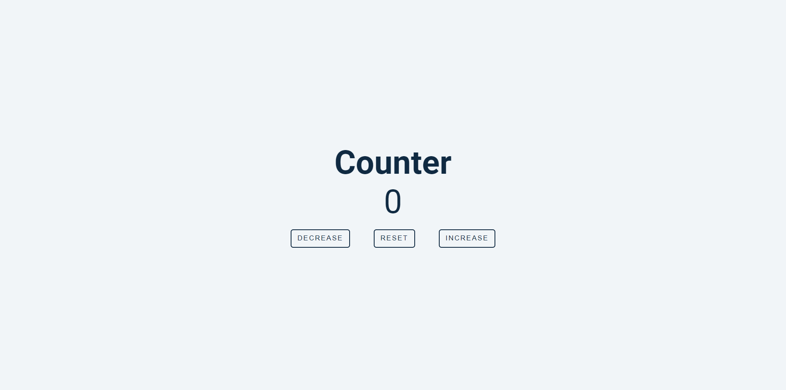

# 15 Vanilla JavaScript Projects

This project is a part of 15 vanilla JavaScript projects.

## Table of contents

- [Overview](#overview)
  - [Screenshot](#screenshot)
  - [Links](#links)
- [My process](#my-process)
  - [Built with](#built-with)
  - [What I learned](#what-i-learned)
- [Other projects in this series](#other-projects)
- [Author](#author)

## Overview

### Screenshot

### Links

- [View live](https://junaidshaikh-js.github.io/counter/)

## My process

### Built with

- Semantic HTML5 markup
- [Sass](https://sass-lang.com/) - CSS extension language
- CSS Flexbox
- JavaScript

### What I learned

I had practised event delegation in this project. In event delegation if you have multiple elements having similar kind of event on them, you group them together in one element and listen to that event on the parent element. It thus reduce the effort of listening event on every single element. Also I divided the program over multiple functions keeping in mind that one funtion should only do one task correctly.

## Other Projects

1. Color Flipper

- [view](https://junaidshaikh-js.github.io/color-flipper/index.html)
- [Github](https://github.com/junaidshaikh-js/color-flipper)

## Author

- Linkedin - [@junaidshaikhjs](https://www.linkedin.com/in/junaidshaikhjs/)
- Twitter - [@junaidshaikh_js](https://twitter.com/junaidshaikh_js)
